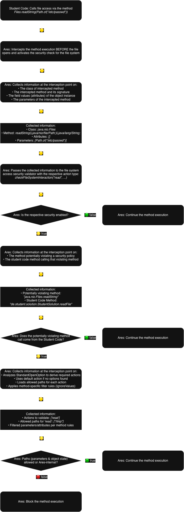

<a id="file-system-security-mechanism"></a>
# File System Security Mechanism

<a id="table-of-contents"></a>
## Table of Contents

1. [Ares 2 AOP File System Access Control: High-Level Overview](#1-ares-2-aop-file-system-access-control-high-level-overview)
   - [1.1 How Does The UML Activity Diagram look like?](#11-how-does-the-uml-activity-diagram-look-like)
   - [1.2 What Is AOP?](#12-what-is-aop)
   - [1.3 Which AOP Modes / Implementations Are There?](#13-which-aop-modes-implementations-are-there)
   - [1.4 What Are The Internal Configuration Settings?](#14-what-are-the-internal-configuration-settings)
   - [1.5 When Is File Access Generally Blocked?](#15-when-is-file-access-generally-blocked)
2. [Ares 2 AOP File System Access Control: Monitored File System Methods](#2-ares-2-aop-file-system-access-control-monitored-file-system-methods)
   - [2.1 Which Operations Does Ares 2 AOP File System Access Control Monitor?](#21-which-operations-does-ares-2-aop-file-system-access-control-monitor)
   - [2.2 What Are The Monitored READ Operations?](#22-what-are-the-monitored-read-operations)
   - [2.3 What Are The Monitored WRITE Operations?](#23-what-are-the-monitored-overwrite-operations)
   - [2.4 What Are The Monitored CREATE Operations?](#24-what-are-the-monitored-create-operations)
   - [2.5 What Are The Monitored DELETE Operations?](#25-what-are-the-monitored-delete-operations)
   - [2.6 What Are The Monitored EXECUTE Operations?](#26-what-are-the-monitored-execute-operations)
3. [Ares 2 AOP File System Access Control: Student Code Triggers the Access Control Check](#3-ares-2-aop-file-system-access-control-student-code-triggers-the-access-control-check)
4. [Ares 2 AOP File System Access Control: Collected Information About the File Access](#4-ares-2-aop-file-system-access-control-collected-information-about-the-file-access)
   - [4.1 What Is The Signature Of The Monitored File System Method?](#41-what-is-the-signature-of-the-monitored-file-system-method)
   - [4.2 What Are The Attribuet Values Of The Object Of The Monitored File System Method?](#42-what-are-the-attribuet-values-of-the-object-of-the-monitored-file-system-method)
   - [4.3 What Are The Parameter Values Of The Monitored File System Method?](#43-what-are-the-parameter-values-of-the-monitored-file-system-method)
   - [4.4 Which Information Is Passed To The Respective Security Validator?](#44-which-information-is-passed-to-the-respective-security-validator)
5. [Ares 2 AOP File System Access Control: Blocking Or Allowing The File Access](#5-ares-2-aop-file-system-access-control-blocking-or-allowing-the-file-access)
   - [5.1 Check 1: Is A Respective AOP Mode Enabled Or Is AOP Fully Disabeled?](#51-check-1-is-a-respective-aop-mode-enabled-or-is-aop-fully-disabeled)
   - [5.2 Check 2: Is the Caller Of The Monitored File System Method The Monitored Student Code?](#52-check-2-is-the-caller-of-the-monitored-file-system-method-the-monitored-student-code)
     - [5.2.1 Load Configuration](#521-load-configuration)
     - [5.2.2 Analyze the Call Chain](#522-analyze-the-call-chain)
     - [5.2.3 Find Which Test Called the Student Code](#523-find-which-test-called-the-student-code)
   - [5.3 Check 3: Which Operations Does The Monitored File System Method Wants To Conduct?](#53-check-3-which-operations-does-the-monitored-file-system-method-wants-to-conduct)
   - [5.4 Check 4: Which Paths Does The Monitored File System Method Wants To Access?](#54-check-4-which-paths-does-the-monitored-file-system-method-wants-to-access)
     - [5.4.1 Load List of Allowed Paths](#541-load-list-of-allowed-paths)
     - [5.4.2 Apply Special Rules for Specific Methods](#542-apply-special-rules-for-specific-methods)
     - [5.4.3 Check Method Parameters for File Paths](#543-check-method-parameters-for-file-paths)
     - [5.4.4 Check Object State for File Paths](#544-check-object-state-for-file-paths)
     - [5.4.5 Allow Ares Internal Files](#545-allow-ares-internal-files)
   - [5.5 Check 5: Block Access with Detailed Error Message](#55-check-5-block-access-with-detailed-error-message)
6. [Ares 2 AOP File System Access Control: Operation Type Classification](#6-ares-2-aop-file-system-access-control-operation-type-classification)
   - [6.1 Kategorie A: OpenOptions-Priorisierung](#61-kategorie-a-openoptions-priorisierung)
   - [6.2 Kategorie B: RandomAccessFile Mode-Erkennung](#62-kategorie-b-randomaccessfile-mode-erkennung)
   - [6.3 Kategorie C: Vorbereitende Operationen](#63-kategorie-c-vorbereitende-operationen)
   - [6.4 Kategorie D: Falsches Subsystem](#64-kategorie-d-falsches-subsystem)
7. [Ares 2 AOP File System Access Control: Conclusion](#7-ares-2-aop-file-system-access-control-conclusion)
   - [7.1 Summary for Programming Instructors (TL;DR)](#71-summary-for-programming-instructors-tldr)
   - [7.2 Technical Details](#72-technical-details)

---

<a id="1-ares-2-aop-file-system-access-control-high-level-overview"></a>
# 1. Ares 2 AOP File System Access Control: High-Level Overview

This document explains how Ares 2 decides whether student code may access the file system through a set of monitored file system methods. It checks:
- The caller of the monitored file system method
- The operations the monitored file system method wants to conduct
- The paths the monitored file system method wants to access
---

<a id="11-how-does-the-uml-activity-diagram-look-like"></a>
## 1.1 How Does The UML Activity Diagram look like?

Below is a general overview of the process for deciding whether to allow or block file access as an UML activity diagram. Throughout this document, you will find the following symbols:
- **🔴 Red** = File access blocked (security policy violation detected)
- **🌕 Yellow** = Intermediate condition met → continue to the next verification step
- **🟢 Green** = File access permitted (no security policy violation detected)



---

<a id="12-what-is-aop"></a>
## 1.2 What Is AOP?

AOP (Aspect-Oriented Programming) is a technique that automatically runs security checks before certain methods execute, without modifying the student code. Think of it like a security guard checking IDs before people enter a building - the building code doesn't change, but everyone gets checked automatically when interacting with the building.

**Concrete Example:**

**Without AOP:** You would have to manually write security checks before every file access (if that is even possible).
```java
public void readFile(String path) {
    if (!isAllowed(path)) throw new SecurityException(); // Security check happens manually and has to be stated explicitly!
    Files.readString(Path.of(path));  // Actual code
}
```

**With AOP:** Ares automatically inserts this check before EVERY `Files.readString()`, so no code changes are required.
```java
public void readFile(String path) {
    Files.readString(Path.of(path));  // Actual code, Security check happens automatically in the background!
}
```

---

<a id="13-which-aop-modes-implementations-are-there"></a>
## 1.3 Which AOP Modes / Implementations Are There?

Ares automatically monitors file system operations by intercepting specific Java methods using one of two AOP implementations:

- **Byte Buddy (Instrumentation Mode)**: Automatically adds security checks when Java loads classes (called bytecode manipulation).
- **AspectJ (AspectJ Mode)**: Automatically adds security checks in a second compilation step (called weaving).

Both implementations set up "checkpoints" that activate **before** the file operation actually happens, giving Ares a chance to verify whether the operation should be allowed or blocked. The validation logic is identical in both modes, but interception coverage differs slightly (AspectJ uses explicit pointcuts; instrumentation uses type-hierarchy maps).

---

<a id="14-what-are-the-internal-configuration-settings"></a>
## 1.4 What Are The Internal Configuration Settings?

Instructors define file system access policies in a policy file, and Ares 2 translates them into the following runtime settings (allowlists are folder prefixes; only paths below them are permitted):

| Setting | Type | Description | Example |
|---------|------|-------------|---------|
| **aopMode** | `String` | The used AOP implementation | `"INSTRUMENTATION"` (Byte Buddy) or `"ASPECTJ"` |
| **restrictedPackage** | `String` | The package containing the student code (the code to be monitored) | `"de.student."` |
| **allowedListedClasses** | `String[]` | The list of classes (usually test classes) that are exempt from supervision | `["de.student.util.Helper"]` |
| **pathsAllowedToBeRead** | `String[]` | The list of folders that the student code can read files from | `["/tmp", "/home/student/input"]` |
| **pathsAllowedToBeOverwritten** | `String[]` | The list of folders that the student code can write files to | `["/tmp", "/home/student/input"]` |
| **pathsAllowedToBeCreated** | `String[]` | The list of folders that the student code can create files in | `["/tmp", "/home/student/input"]` |
| **pathsAllowedToBeExecuted** | `String[]` | The list of folders that the student code can execute files in | `["/tmp", "/home/student/input"]` |
| **pathsAllowedToBeDeleted** | `String[]` | The list of folders that the student code can delete files in | `["/tmp", "/home/student/input"]` |

---

<a id="15-when-is-file-access-generally-blocked"></a>
## 1.5 When Is File Access Generally Blocked?

**Access is BLOCKED 🔴 if ALL of the following conditions apply:**

1. **Security enabled**: `aopMode` is set to `"INSTRUMENTATION"` or `"ASPECTJ"`
2. **Student code detected**: The call stack contains classes in `restrictedPackage` and not in `allowedListedClasses`
3. **Derived actions**: The actions are derived from the intercepted method and any `StandardOpenOption` values (may include multiple actions)
4. **Path violation found**: After method-specific parameter filtering, at least one extracted path (from parameters or attributes) does not match the list of allowed paths for its allowed actions
5. **Not internal to Ares**: The violating path is not an internal configuration/resource file of Ares (applies to attribute-based violations; parameter-based violations are blocked immediately)

Plain-language summary: if student code triggers a monitored file method and the path is outside the allowlist for the needed action, Ares blocks the access.

**Access is ALLOWED 🟢 if ANY of the aforementioned conditions do not apply**

Summarising this, Ares trusts code when: 
- It is located outside of the `restrictedPackage`
- It is located inside of the `restrictedPackage`, but its classes are listed in `allowedListedClasses` within the student package
- It is listed as Ares internal code

**Security Assumptions:** 
- Student code cannot modify Ares security settings (guaranteed by making settings private; reflection is disabled for student code)
- Student code cannot interfere with security monitoring (guaranteed by making settings private; reflection is disabled for student code)
- Student code executes after Ares is initialized (guaranteed by build pipeline)

---

<a id="2-ares-2-aop-file-system-access-control-monitored-file-system-methods"></a>
# 2. Ares 2 AOP File System Access Control: Monitored File System Methods

<a id="21-which-operations-does-ares-2-aop-file-system-access-control-monitor"></a>
## 2.1 Which Operations Does Ares 2 AOP File System Access Control Monitor?

Ares classifies file system interactions into five action types. These labels drive which allowlist is checked.

- **READ**: Accessing file contents or metadata without modifying them (streams, read APIs, attribute queries).
- **OVERWRITE**: Writing or mutating existing content/attributes (write/append/truncate, metadata setters).
- **CREATE**: Creating new files, directories, or links (create* APIs, file system creation/open).
- **DELETE**: Removing files or scheduling deletion/trash operations.
- **EXECUTE**: Operations that launch or open files with external programs (for example, `Runtime.exec(...)` or `ProcessBuilder.start(...)`).

Some APIs can appear under multiple actions because they imply more than one permission (for example, `copy`/`move` or `StandardOpenOption` combinations).

---

<a id="22-what-are-the-monitored-read-operations"></a>
## 2.2 What Are The Monitored READ Operations?

**Security Component:** Read operation monitor

**Monitored APIs:**

Read APIs listed below access file contents or metadata without modifying them.

> **Note on "Tested by RP" column:** A ✅ means that this API is the **primary target** of a dedicated test in the Reproducibility Package. For example, if a test uses `BufferedInputStream` to wrap a `FileInputStream`, only the wrapper (`BufferedInputStream.<new>`) is marked as ✅, not the underlying `FileInputStream.<new>` which is merely a helper call in that context.

**Reads any formatted file fully**

| Class (fully qualified) | Method | Pointcut in AspectJ | Pointcut in Byte Buddy | Tested by RP |
| --- | --- | --- | --- | --- |
| java.io.FileInputStream | `<new>` | ✅ | ✅ | ✅ |
| java.io.BufferedInputStream | `<new>` | ✅ | ✅ | ✅ |
| java.io.RandomAccessFile | `<new>` | ✅ | ✅ | ✅ |
| java.nio.channels.AsynchronousFileChannel | read | ✅ | ✅ | ❌ (triggers Thread security) |
| java.nio.channels.AsynchronousFileChannel | open | ✅ | ✅ | ❌ (triggers Thread security) |
| java.nio.channels.FileChannel | open | ✅ | ✅ | ✅ |
| java.nio.channels.FileChannel | map | ✅ | ✅ | ✅ |
| java.nio.file.Files | newByteChannel | ✅ | ✅ | ✅ |
| java.nio.file.Files | newInputStream | ✅ | ✅ | ✅ |
| java.nio.file.Files | readAllBytes | ✅ | ✅ | ✅ |
| java.lang.ClassLoader | getResourceAsStream | ✅ | ✅ | ❌ (triggers Reflection security) |

**Reads UTF-8 text/tokens fully**

| Class (fully qualified) | Method | Pointcut in AspectJ | Pointcut in Byte Buddy | Tested by RP |
| --- | --- | --- | --- | --- |
| java.io.Reader | `<new>` | ✅ | ✅ | ✅ |
| java.nio.file.Files | newBufferedReader | ✅ | ✅ | ✅ |
| java.nio.file.Files | readString | ✅ | ✅ | ✅ |
| java.nio.file.Files | lines | ✅ | ✅ | ✅ |
| java.nio.file.Files | readAllLines | ✅ | ✅ | ✅ |
| java.util.Scanner | `<new>` | ✅ | ✅ | ✅ |

**Reads only specifically formatted files fully**

| Class (fully qualified) | Method | Pointcut in AspectJ | Pointcut in Byte Buddy | Tested by RP |
| --- | --- | --- | --- | --- |
| java.io.DataInputStream | `<new>` | ✅ | ✅ | ❌ |
| java.io.DataInput | read | ✅ | ✅ | ❌ |
| java.io.DataInput | readBoolean | ✅ | ✅ | ❌ |
| java.io.DataInput | readByte | ✅ | ✅ | ❌ |
| java.io.DataInput | readChar | ✅ | ✅ | ❌ |
| java.io.DataInput | readDouble | ✅ | ✅ | ❌ |
| java.io.DataInput | readFloat | ✅ | ✅ | ❌ |
| java.io.DataInput | readFully | ✅ | ✅ | ❌ |
| java.io.DataInput | readInt | ✅ | ✅ | ❌ |
| java.io.DataInput | readLine | ✅ | ✅ | ❌ |
| java.io.DataInput | readLong | ✅ | ✅ | ❌ |
| java.io.DataInput | readShort | ✅ | ✅ | ❌ |
| java.io.DataInput | readUTF | ✅ | ✅ | ❌ |
| java.io.DataInput | readUnsignedByte | ✅ | ✅ | ❌ |
| java.io.DataInput | readUnsignedShort | ✅ | ✅ | ❌ |
| javax.imageio.ImageIO | createImageInputStream | ✅ | ✅ | ❌ |
| javax.imageio.ImageIO | read | ✅ | ✅ | ❌ |
| javax.sound.sampled.AudioSystem | getAudioInputStream | ✅ | ✅ | ❌ |
| javax.xml.bind.Unmarshaller | unmarshal | ✅ | ✅ | ❌ |
| javax.xml.parsers.DocumentBuilder | parse | ✅ | ✅ | ❌ |
| javax.xml.parsers.SAXParser | parse | ✅ | ✅ | ❌ |
| java.awt.Toolkit | createImage | ✅ | ✅ | ❌ |
| java.awt.Toolkit | getImage | ✅ | ✅ | ❌ |
| javax.imageio.ImageIO | getImageReaders | ✅ | ✅ | ❌ |
| javax.sound.midi.MidiSystem | getSoundbank | ✅ | ✅ | ❌ |
| java.awt.Font | createFont | ✅ | ✅ | ❌ |
| java.awt.Font | createFonts | ✅ | ✅ | ❌ |
| javax.imageio.stream.FileCacheImageInputStream | `<new>` | ✅ | ✅ | ❌ |
| javax.imageio.stream.FileImageInputStream | `<new>` | ✅ | ✅ | ❌ |

**Reads archive files (ZIP/JAR/GZIP)**

| Class (fully qualified) | Method | Pointcut in AspectJ | Pointcut in Byte Buddy | Tested by RP |
| --- | --- | --- | --- | --- |
| java.util.zip.ZipInputStream | `<new>` | ✅ | ✅ | ❌ |
| java.util.zip.ZipInputStream | getNextEntry | ✅ | ✅ | ❌ |
| java.util.jar.JarInputStream | `<new>` | ✅ | ✅ | ❌ |
| java.util.jar.JarInputStream | getNextJarEntry | ✅ | ✅ | ❌ |
| java.util.zip.GZIPInputStream | `<new>` | ✅ | ✅ | ❌ |
| java.util.zip.ZipFile | `<new>` | ✅ | ✅ | ❌ |
| java.util.zip.ZipFile | entries | ✅ | ✅ | ❌ |
| java.util.zip.ZipFile | getInputStream | ✅ | ✅ | ❌ |
| java.util.jar.JarFile | `<new>` | ✅ | ✅ | ❌ |
| java.util.jar.JarFile | entries | ✅ | ✅ | ❌ |
| java.util.jar.JarFile | getInputStream | ✅ | ✅ | ❌ |

**Reads configuration/properties files**

| Class (fully qualified) | Method | Pointcut in AspectJ | Pointcut in Byte Buddy | Tested by RP |
| --- | --- | --- | --- | --- |
| java.util.Properties | load | ✅ | ✅ | ❌ |
| java.util.Properties | loadFromXML | ✅ | ✅ | ❌ |

**Reads only specific parts of a file**

| Class (fully qualified) | Method | Pointcut in AspectJ | Pointcut in Byte Buddy | Tested by RP |
| --- | --- | --- | --- | --- |
| java.io.RandomAccessFile | read | ✅ | ✅ | ❌ |
| java.io.InputStream | read | ✅ | ✅ | ❌ |
| java.io.Reader | read | ✅ | ✅ | ❌ |
| java.nio.channels.SeekableByteChannel | read | ✅ | ✅ | ❌ |

**Only reads the file hierarchy**

| Class (fully qualified) | Method | Pointcut in AspectJ | Pointcut in Byte Buddy | Tested by RP |
| --- | --- | --- | --- | --- |
| java.io.File | normalizedList | ✅ | ✅ | ❌ |
| java.io.File | list | ✅ | ✅ | ❌ |
| java.io.File | listFiles | ✅ | ✅ | ❌ |
| java.io.File | listRoots | ✅ | ✅ | ❌ |
| java.nio.file.Files | find | ✅ | ✅ | ❌ |
| java.nio.file.Files | list | ✅ | ✅ | ❌ |
| java.nio.file.Files | newDirectoryStream | ✅ | ✅ | ❌ |
| java.nio.file.Files | walk | ✅ | ✅ | ❌ |
| java.nio.file.Files | walkFileTree | ✅ | ✅ | ❌ |
| java.nio.file.spi.FileSystemProvider | newDirectoryStream | ✅ | ✅ | ❌ |

---

<a id="23-what-are-the-monitored-overwrite-operations"></a>
## 2.3 What Are The Monitored WRITE Operations?

**Security Component:** Write operation monitor

**Monitored APIs:**

Write APIs listed below modify existing content or attributes.

> **Note on "Tested by RP" column:** A ✅ means that this API is the **primary target** of a dedicated test in the Reproducibility Package. For example, if a test uses `BufferedWriter` to wrap a `FileWriter`, only the wrapper (`BufferedWriter.<new>`) is marked as ✅, not the underlying `FileWriter.<new>` which is merely a helper call in that context.

**Writes any format fully to a file**

> **Note:** `FileChannel.open`, `AsynchronousFileChannel.open`, and `FileChannel.map` do NOT have dedicated WRITE pointcuts. These methods are monitored via READ pointcuts, and the actual operation type is determined dynamically:
> - `FileChannel.open` / `AsynchronousFileChannel.open`: Classified based on `OpenOption` parameters via `deriveActionChecks()`
> - `FileChannel.map`: Classified based on `MapMode` parameter (e.g., `READ_WRITE` vs `READ_ONLY`)

> **Note on generic write/close/flush methods:** Generic `write()`, `close()`, and `flush()` methods on stream classes (e.g., `OutputStream.write()`, `Writer.flush()`) are intentionally **NOT monitored**. Reason: `System.out` and `System.err` internally call these methods, which would cause false positives. File access is already blocked at the constructor level, making these additional checks redundant.

| Class (fully qualified) | Method | Pointcut in AspectJ | Pointcut in Byte Buddy | Tested by RP |
| --- | --- | --- | --- | --- |
| java.io.FileOutputStream | `<new>` | ✅ | ✅ | ✅ |
| java.io.BufferedOutputStream | `<new>` | ✅ | ✅ | ✅ |
| java.io.RandomAccessFile | `<new>` | ✅ | ✅ | ✅ |
| java.nio.channels.AsynchronousFileChannel | write | ✅ | ✅ | ❌ |
| java.nio.channels.AsynchronousFileChannel | open | ❌ (via OpenOptions) | ❌ (via OpenOptions) | ❌ |
| java.nio.channels.FileChannel | open | ❌ (via OpenOptions) | ❌ (via OpenOptions) | ✅ |
| java.nio.channels.FileChannel | map | ❌ (via MapMode) | ❌ (via MapMode) | ✅ |
| java.nio.channels.FileChannel | write | ✅ | ✅ | ✅ |
| java.nio.file.Files | newByteChannel | ❌ (via OpenOptions) | ❌ (via OpenOptions) | ✅ |
| java.nio.file.Files | newOutputStream | ✅ | ✅ | ✅ |
| java.nio.file.Files | write | ✅ | ✅ | ✅ |

**Writes UTF-8 text/tokens fully**

| Class (fully qualified) | Method | Pointcut in AspectJ | Pointcut in Byte Buddy | Tested by RP |
| --- | --- | --- | --- | --- |
| java.io.Writer | `<new>` | ✅ | ✅ | ✅ |
| java.nio.file.Files | newBufferedWriter | ✅ | ✅ | ✅ |
| java.nio.file.Files | writeString | ✅ | ✅ | ✅ |

**Writes only specifically formatted files fully**

| Class (fully qualified) | Method | Pointcut in AspectJ | Pointcut in Byte Buddy | Tested by RP |
| --- | --- | --- | --- | --- |
| java.io.DataOutputStream | `<new>` | ✅ | ✅ | ❌ |
| java.io.DataOutput | writeBoolean | ✅ | ✅ | ❌ |
| java.io.DataOutput | writeByte | ✅ | ✅ | ❌ |
| java.io.DataOutput | writeBytes | ✅ | ✅ | ❌ |
| java.io.DataOutput | writeChar | ✅ | ✅ | ❌ |
| java.io.DataOutput | writeChars | ✅ | ✅ | ❌ |
| java.io.DataOutput | writeDouble | ✅ | ✅ | ❌ |
| java.io.DataOutput | writeFloat | ✅ | ✅ | ❌ |
| java.io.DataOutput | writeInt | ✅ | ✅ | ❌ |
| java.io.DataOutput | writeLong | ✅ | ✅ | ❌ |
| java.io.DataOutput | writeShort | ✅ | ✅ | ❌ |
| java.io.DataOutput | writeUTF | ✅ | ✅ | ❌ |
| javax.imageio.ImageIO | write | ✅ | ✅ | ❌ |
| javax.imageio.ImageIO | createImageOutputStream | ✅ | ✅ | ❌ |
| javax.sound.sampled.AudioSystem | write | ✅ | ✅ | ❌ |
| javax.xml.bind.Marshaller | marshal | ✅ | ✅ | ❌ |
| javax.xml.transform.Transformer | transform | ✅ | ✅ | ❌ |
| java.io.PrintStream | `<new>` | ✅ | ✅ | ❌ |
| java.util.logging.FileHandler | `<new>` | ✅ | ✅ | ❌ |
| java.util.logging.FileHandler | publish | ✅ | ✅ | ❌ |
| java.util.logging.FileHandler | close | ✅ | ✅ | ❌ |
| java.util.zip.InflaterOutputStream | `<new>` | ✅ | ✅ | ❌ |
| javax.print.DocPrintJob | print | ✅ | ✅ | ❌ |

**Writes archive files (ZIP/JAR/GZIP)**

| Class (fully qualified) | Method | Pointcut in AspectJ | Pointcut in Byte Buddy | Tested by RP |
| --- | --- | --- | --- | --- |
| java.util.zip.ZipOutputStream | `<new>` | ✅ | ✅ | ❌ |
| java.util.zip.ZipOutputStream | putNextEntry | ✅ | ✅ | ❌ |
| java.util.jar.JarOutputStream | `<new>` | ✅ | ✅ | ❌ |
| java.util.jar.JarOutputStream | putNextEntry | ✅ | ✅ | ❌ |
| java.util.zip.GZIPOutputStream | `<new>` | ✅ | ✅ | ❌ |
| java.util.zip.ZipOutputStream | closeEntry | ✅ | ✅ | ❌ |
| java.util.jar.JarOutputStream | closeEntry | ✅ | ✅ | ❌ |

**Writes configuration/properties files**

| Class (fully qualified) | Method | Pointcut in AspectJ | Pointcut in Byte Buddy | Tested by RP |
| --- | --- | --- | --- | --- |
| java.util.Properties | store | ✅ | ✅ | ❌ |
| java.util.Properties | storeToXML | ✅ | ✅ | ❌ |
| java.util.Formatter | `<new>` | ✅ | ✅ | ❌ |

**Writes only specific parts to a file**

| Class (fully qualified) | Method | Pointcut in AspectJ | Pointcut in Byte Buddy | Tested by RP |
| --- | --- | --- | --- | --- |
| java.nio.channels.AsynchronousFileChannel | truncate | ✅ | ✅ | ❌ |
| java.nio.channels.FileChannel | truncate | ✅ | ✅ | ❌ |
| java.nio.channels.FileChannel | transferTo | ✅ | ✅ | ❌ |
| java.nio.file.attribute.UserDefinedFileAttributeView | write | ✅ | ✅ | ❌ |

**Only writes the file hierarchy (metadata/attributes)**

| Class (fully qualified) | Method | Pointcut in AspectJ | Pointcut in Byte Buddy | Tested by RP |
| --- | --- | --- | --- | --- |
| java.io.File | setExecutable | ✅ | ✅ | ❌ |
| java.io.File | setLastModified | ✅ | ✅ | ❌ |
| java.io.File | setReadOnly | ✅ | ✅ | ❌ |
| java.io.File | setReadable | ✅ | ✅ | ❌ |
| java.io.File | setWritable | ✅ | ✅ | ❌ |
| java.io.File | renameTo | ✅ | ✅ | ❌ |
| java.nio.file.Files | copy | ✅ | ✅ | ❌ |
| java.nio.file.Files | move | ✅ | ✅ | ❌ |
| java.nio.file.Files | setAttribute | ✅ | ✅ | ❌ |
| java.nio.file.Files | setLastModifiedTime | ✅ | ✅ | ❌ |
| java.nio.file.Files | setOwner | ✅ | ✅ | ❌ |
| java.nio.file.Files | setPosixFilePermissions | ✅ | ✅ | ❌ |
| java.nio.file.spi.FileSystemProvider | copy | ✅ | ✅ | ❌ |
| java.nio.file.spi.FileSystemProvider | move | ✅ | ✅ | ❌ |
| java.nio.file.spi.FileSystemProvider | setAttribute | ✅ | ✅ | ❌ |

---

<a id="24-what-are-the-monitored-create-operations"></a>
## 2.4 What Are The Monitored CREATE Operations?

**Security Component:** Create operation monitor

**Monitored APIs:**

Link creation APIs and conditional creates (e.g., `FileChannel.open` with create options) are listed under Creates files.

**Creates files**

> **Note:** `FileChannel.open` and `AsynchronousFileChannel.open` do NOT have dedicated CREATE pointcuts in either AspectJ or Byte Buddy. These methods are monitored via READ pointcuts, and the actual operation type (read/write/create) is determined dynamically by analyzing the `OpenOption` parameters via `deriveActionChecks()`. When called with `CREATE` or `CREATE_NEW` options, they are classified as create operations at runtime.

| Class (fully qualified) | Method | Pointcut in AspectJ | Pointcut in Byte Buddy | Tested by RP |
| --- | --- | --- | --- | --- |
| java.io.File | createNewFile | ✅ | ✅ | ✅ |
| java.io.File | createTempFile | ✅ | ✅ | ✅ |
| java.nio.file.Files | createFile | ✅ | ✅ | ✅ |
| java.nio.file.Files | createTempFile | ✅ | ✅ | ✅ |
| java.nio.file.Files | createLink | ✅ | ✅ | ✅ |
| java.nio.file.Files | createSymbolicLink | ✅ | ✅ | ✅ |
| java.io.BufferedOutputStream | `<new>` | ✅ | ✅ | ✅ |
| java.io.BufferedWriter | `<new>` | ✅ | ✅ | ✅ |
| java.io.FileOutputStream | `<new>` | ✅ | ✅ | ✅ |
| java.io.FileWriter | `<new>` | ✅ | ✅ | ✅ |
| java.io.PrintWriter | `<new>` | ✅ | ✅ | ✅ |
| java.io.RandomAccessFile | `<new>` | ✅ | ✅ | ✅ |
| java.nio.file.Files | newBufferedWriter | ✅ | ✅ | ✅ |
| java.nio.file.Files | newOutputStream | ✅ | ✅ | ✅ |
| java.nio.channels.AsynchronousFileChannel | open | ❌ (via OpenOptions) | ❌ (via OpenOptions) | ❌ |
| java.nio.channels.FileChannel | open | ❌ (via OpenOptions) | ❌ (via OpenOptions) | ✅ |

**Creates folders**

| Class (fully qualified) | Method | Pointcut in AspectJ | Pointcut in Byte Buddy | Tested by RP |
| --- | --- | --- | --- | --- |
| java.io.File | mkdir | ✅ | ✅ | ✅ |
| java.io.File | mkdirs | ✅ | ✅ | ✅ |
| java.nio.file.Files | createDirectories | ✅ | ✅ | ✅ |
| java.nio.file.Files | createDirectory | ✅ | ✅ | ✅ |
| java.nio.file.Files | createTempDirectory | ✅ | ✅ | ✅ |
| java.nio.file.spi.FileSystemProvider | createDirectory | ✅ | ✅ | ✅ |

---

<a id="25-what-are-the-monitored-delete-operations"></a>
## 2.5 What Are The Monitored DELETE Operations?

**Security Component:** Delete operation monitor

**Monitored APIs:**

Delete APIs listed below can remove files and empty directories.

**Delete files**

| Class (fully qualified) | Method | Pointcut in AspectJ | Pointcut in Byte Buddy | Tested by RP |
| --- | --- | --- | --- | --- |
| java.io.File | delete | ✅ | ✅ | ✅ |
| java.nio.file.Files | delete | ✅ | ✅ | ✅ |
| java.nio.file.Files | deleteIfExists | ✅ | ✅ | ✅ |
| java.awt.Desktop | moveToTrash | ✅ | ✅ | ❌ |
| java.io.File | deleteOnExit | ✅ | ✅ | ✅ |

**Delete folders**

| Class (fully qualified) | Method | Pointcut in AspectJ | Pointcut in Byte Buddy | Tested by RP |
| --- | --- | --- | --- | --- |
| java.io.File | delete | ✅ | ✅ | ✅ |
| java.nio.file.Files | delete | ✅ | ✅ | ✅ |
| java.nio.file.Files | deleteIfExists | ✅ | ✅ | ✅ |
| java.awt.Desktop | moveToTrash | ✅ | ✅ | ❌ |
| java.io.File | deleteOnExit | ✅ | ✅ | ✅ |

**Also monitored in delete pointcuts (can delete source file)**

| Class (fully qualified) | Method | Pointcut in AspectJ | Pointcut in Byte Buddy | Tested by RP |
| --- | --- | --- | --- | --- |
| java.nio.file.Files | copy | ✅ | ✅ | ❌ |
| java.nio.file.Files | move | ✅ | ✅ | ❌ |

---

<a id="26-what-are-the-monitored-execute-operations"></a>
## 2.6 What Are The Monitored EXECUTE Operations?

**What does "Execute" mean?** File system actions that trigger execution-like behavior such as launching processes or opening files with their default programs (e.g., `Runtime.exec(...)` or `ProcessBuilder.start(...)`).

**Security Component:** Execute operation monitor

**Monitored APIs:**

Execute APIs listed below trigger execution-like behavior on files.

**Executes the file on the console (command line execution)**

> **Note:** `ProcessBuilder.start()`, `ProcessBuilder.startPipeline()`, and `Runtime.exec()` are handled by the **Command System** rather than the File System in both AspectJ and Byte Buddy modes, as they execute commands rather than individual files. The File System pointcuts for execute only cover library loading (`load`/`loadLibrary`).

| Class (fully qualified) | Method | Pointcut in AspectJ | Pointcut in Byte Buddy | Tested by RP |
| --- | --- | --- | --- | --- |
| java.lang.Runtime | load | ✅ | ✅ | ❌ |
| java.lang.Runtime | loadLibrary | ✅ | ✅ | ❌ |
| java.lang.System | load | ✅ | ✅ | ❌ |
| java.lang.System | loadLibrary | ✅ | ✅ | ❌ |

**Opens files with default applications (Desktop integration)**

| Class (fully qualified) | Method | Pointcut in AspectJ | Pointcut in Byte Buddy | Tested by RP |
| --- | --- | --- | --- | --- |
| java.awt.Desktop | open | ✅ | ✅ | ❌ |
| java.awt.Desktop | edit | ✅ | ✅ | ❌ |
| java.awt.Desktop | print | ✅ | ✅ | ❌ |
| java.awt.Desktop | browse | ✅ | ✅ | ❌ |
| java.awt.Desktop | browseFileDirectory | ✅ | ✅ | ❌ |
| java.awt.Desktop | mail | ✅ | ✅ | ❌ |
| java.awt.Desktop | openHelpViewer | ✅ | ✅ | ❌ |
| java.awt.Desktop | setDefaultMenuBar | ✅ | ✅ | ❌ |
| java.awt.Desktop | setOpenFileHandler | ✅ | ✅ | ❌ |
| java.awt.Desktop | setOpenURIHandler | ✅ | ✅ | ❌ |

---

<a id="3-ares-2-aop-file-system-access-control-student-code-triggers-the-access-control-check"></a>
# 3. Ares 2 AOP File System Access Control: Student Code Triggers the Access Control Check

When student code (any code within the configured restricted package) calls one of these monitored methods, Ares automatically performs a security check **before** the file operation executes.

**Example:**
```java
// Student Code
package de.student.solution;

import java.nio.file.Files;
import java.nio.file.Path;

public class StudentSolution {
    public void readFile() throws Exception {
        // This call triggers JavaInstrumentationReadPathMethodAdvice
        String content = Files.readString(Path.of("/etc/passwd"));
    }
}
```

When the `Files.readString(Path.of("/etc/passwd"))` method is called, Ares intercepts the call:
- **Byte Buddy**: Automatically runs a security check before the method executes (technical implementation: `JavaInstrumentationReadPathMethodAdvice.onEnter()`)
- **AspectJ**: Automatically runs a security check before the method executes (technical implementation: `before()` advice in `JavaAspectJFileSystemAdviceDefinitions.aj`)

Ares then checks whether the student is allowed to access `Path.of("/etc/passwd")` **before** the file is actually read.

---

<a id="4-ares-2-aop-file-system-access-control-collected-information-about-the-file-access"></a>
# 4. Ares 2 AOP File System Access Control: Collected Information About the File Access

The security monitor collects information about what's happening: Which method is being called, what file path is being accessed, and where in the student code this is happening.

**Collection Mechanisms:**

- **Byte Buddy**: Uses special Java annotations (`@Advice`) to automatically capture information about the intercepted method (technical implementation: `JavaInstrumentationReadPathMethodAdvice.onEnter()`)
- **AspectJ**: Receives method information automatically through a parameter object called `JoinPoint` (technical implementation: `checkFileSystemInteraction()` method)

Both approaches collect the same information:

**What is collected:**
- **Method information**: Which method was called
- **Object state**: Internal state of the object
- **Parameters**: Values passed to the method

**Why do we need all three types of information?**

File paths can appear in **different places** depending on how the method is used:

1. **Method information is needed** to identify which operation is attempted and apply special handling rules
   - Example: Some methods like `Files.copy()` need both source and destination paths checked

2. **Object state is needed** because paths can be stored inside objects
   - Example: `file.delete()` - The path is in `file.path` field, not passed as parameter

3. **Parameters are needed** because paths are often passed as method arguments
   - Example: `Files.readString(Path.of("/etc/passwd"))` - The path `"/etc/passwd"` is a parameter

**What is NOT collected here:** Whether the access is allowed or blocked - that determination happens in the **next step** (Section 5: Ares Validates the File Access)

---

<a id="41-what-is-the-signature-of-the-monitored-file-system-method"></a>
## 4.1 What Is The Signature Of The Monitored File System Method?

**1. What Information Do We Collect:**

| Information | Type | Description |
|-------------|------|-------------|
| **declaringTypeName** | `String` | **Class name** where the method is defined. Example: `"java.io.FileInputStream"`. |
| **methodName** | `String` | **Method name**. Example: `"read"` or `"<init>"` for constructors. |
| **methodSignature** | `String` | **Method signature** with parameter types. Example: `"(Ljava/lang/String;)V"` for a constructor taking a String. **Reading signatures:** `(Ljava/lang/String;)V` means "takes a String parameter, returns void (nothing)" - like a function signature: `constructor(String fileName) → returns nothing`. |

> 💡 **Method Signature Explained:** `(Ljava/lang/String;)V`
> - `(` = Parameter list begins
> - `Ljava/lang/String;` = Parameter of type String
> - `)` = Parameter list ends  
> - `V` = "void" (no return value)
>
> **More Examples:**
> - `()V` = no parameters, void return
> - `(II)I` = two int parameters, returns int
> - `(Ljava/nio/file/Path;)Ljava/lang/String;` = Path parameter, returns String

**2. How Do We Collect This Information:**

**Byte Buddy (Instrumentation) Mode:**
```java
@Advice.OnMethodEnter
public static void onEnter(
    @Advice.Origin("#t") String declaringTypeName,  // Class name
    @Advice.Origin("#m") String methodName,          // Method name
    @Advice.Origin("#s") String methodSignature      // Full signature
) {
    // Information is now available for validation
}
```

**AspectJ Mode:**
```aspectj
public void checkFileSystemInteraction(
    String action,
    JoinPoint thisJoinPoint
) {
    String declaringTypeName = thisJoinPoint.getSignature().getDeclaringTypeName();
    String methodName = thisJoinPoint.getSignature().getName();
    String methodSignature = thisJoinPoint.getSignature().toLongString();
    // Information is now available for validation
}
```

**3. How All Method Information Is Used:**
- Identify which file operation was attempted
- Look up special handling rules for specific methods
- Distinguish between different versions of the same method (overloading)
- Example: `java.io.FileInputStream.<init>(Ljava/lang/String;)V` → Identifies a `FileInputStream` constructor taking a String parameter

---

<a id="42-what-are-the-attribuet-values-of-the-object-of-the-monitored-file-system-method"></a>
## 4.2 What Are The Attribuet Values Of The Object Of The Monitored File System Method?

**1. What Information Do We Collect:**

| Information | Type | Description |
|-------------|------|-------------|
| **instance** | `Object` | **The object** on which the method is called (the `this` reference). `null` for constructors since the object doesn't exist yet. |
| **attributes** | `Object[]` | **Array of the object's internal field values**. The actual values stored in each field. **Note:** Empty for constructors since object doesn't exist yet. |

**2. How Do We Collect This Information:**

**Byte Buddy (Instrumentation) Mode:**
```java
@Advice.OnMethodEnter
public static void onEnter(
    @Advice.This(optional = true) Object instance  // The object on which method is called
) {
    // Extract attributes using reflection (see below)
}
```

**AspectJ Mode:**
```aspectj
public void checkFileSystemInteraction(
    String action,
    JoinPoint thisJoinPoint
) {
    Object instance = thisJoinPoint.getTarget();  // Get the object instance
    // Extract attributes using reflection (see below)
}
```

**Both modes then use identical attribute extraction (using Java's built-in ability to inspect object contents):**
```java
// For constructors, instance is null (object doesn't exist yet)
if (instance == null) {
    return;  // Skip for constructors
}

// Ares uses Java's inspection capabilities to access private fields
final Field[] fields = instance.getClass().getDeclaredFields();
final Object[] attributes = new Object[fields.length];

for (int i = 0; i < fields.length; i++) {
    try {
        fields[i].setAccessible(true);  // Make private fields accessible
        attributes[i] = fields[i].get(instance);  // Read the value
    } catch (InaccessibleObjectException | IllegalAccessException | SecurityException e) {
        continue;  // Skip fields that cannot be accessed
    } catch (IllegalArgumentException e) {
        throw new SecurityException("Invalid field access: " + fields[i].getName(), e);
    } catch (NullPointerException e) {
        throw new SecurityException("Null pointer accessing field: " + fields[i].getName(), e);
    } catch (ExceptionInInitializerError e) {
        throw new SecurityException("Initialization error for field: " + fields[i].getName(), e);
    }
}
```

**3. How All Object State Information Is Used:**
- Extract file paths that might be stored inside the object
- Check object fields for security violations
- Access internal state even if not passed as parameters
- Example: `File` object with `path` field = `"/etc/passwd"` → Path extracted from `attributes` array → Checked against allowed paths

---

<a id="43-what-are-the-parameter-values-of-the-monitored-file-system-method"></a>
## 4.3 What Are The Parameter Values Of The Monitored File System Method?

**1. What Information Do We Collect:**

| Information | Type | Description |
|------------|------|-------------|
| **parameters** | `Object[]` | **Method arguments** - the values passed to the method when it was called. |

**2. How Do We Collect This Information:**

**Byte Buddy (Instrumentation) Mode:**
```java
@Advice.OnMethodEnter
public static void onEnter(
    @Advice.AllArguments Object[] parameters  // All method arguments
) {
    // Parameters array contains all values passed to the method
}
```

**AspectJ Mode:**
```aspectj
public void checkFileSystemInteraction(
    String action,
    JoinPoint thisJoinPoint
) {
    Object[] parameters = thisJoinPoint.getArgs();  // Get method arguments
}
```

**3. How All Parameter Information Is Used:**
- Extract file paths from method arguments
- Convert paths to standard format (`Path.normalize().toAbsolutePath()`)
- Check extracted paths against allowed paths list
- Example: `Files.readString(Path.of("/etc/passwd"))` → parameters = `[Path.of("/etc/passwd")]` → Checked against allowed paths

---

<a id="44-which-information-is-passed-to-the-respective-security-validator"></a>
## 4.4 Which Information Is Passed To The Respective Security Validator?

After collecting this information, Ares passes it to the security validation component.

> 💡 **Concrete Example:** `Files.readString(Path.of("/etc/passwd"))`
> ```
> Collected Information:
> ├─ action: "read"
> ├─ declaringTypeName: "java.nio.file.Files"
> ├─ methodName: "readString"
> ├─ methodSignature: "(Ljava/nio/file/Path;)Ljava/lang/String;"
> ├─ parameters: [Path.of("/etc/passwd")]
> ├─ attributes: [] (not applicable for static method)
> └─ instance: null (static method has no instance)
> ```

**Where does the action type come from?**

The action type (e.g., `"read"`) is **automatically determined** based on which method was intercepted:

| Intercepted Method Example | Action Type |
|---------------------------|-------------|
| `FileInputStream.read()`, `Files.readString()` | `"read"` |
| `FileOutputStream.write()`, `Files.write()` | `"overwrite"` |
| `File.createNewFile()`, `Files.createFile()` | `"create"` |
| `File.delete()`, `Files.delete()` | `"delete"` |
| `Runtime.exec()`, `ProcessBuilder.start()` | `"execute"` |

**For File System Operations:**
```java
checkFileSystemInteraction(
    "read",               // What type of operation? (from table above)
    declaringTypeName,    // Which class?
    methodName,           // Which method?
    methodSignature,      // Exact signature?
    attributes,           // Object's internal field values (Object[])
    parameters,           // Values passed to method (Object[])
    instance              // The object instance (for additional context)
)
```

**How is the action determined?**

The action type is **hardcoded** based on which methods are intercepted:

**Byte Buddy (Instrumentation Mode)** - Separate advice classes:
- `JavaInstrumentationReadPathMethodAdvice` → Uses `"read"`
- `JavaInstrumentationOverwritePathMethodAdvice` → Uses `"overwrite"`
- `JavaInstrumentationCreatePathMethodAdvice` → Uses `"create"`
- `JavaInstrumentationDeletePathMethodAdvice` → Uses `"delete"`
- `JavaInstrumentationExecutePathMethodAdvice` → Uses `"execute"`

**AspectJ Mode** - Multiple `before()` advice in one aspect:
- `before(): fileReadMethods()` → Uses `"read"`
- `before(): fileWriteMethods()` → Uses `"overwrite"`
- `before(): fileCreateMethods()` → Uses `"create"`
- `before(): fileDeleteMethods()` → Uses `"delete"`
- `before(): fileExecuteMethods()` → Uses `"execute"`

**Possible action values:**
- `"read"` - Reading from files
- `"overwrite"` - Writing to or modifying files
- `"create"` - Creating new files or directories
- `"delete"` - Deleting files or directories
- `"execute"` - Executing files or opening them with external programs

---

<a id="5-ares-2-aop-file-system-access-control-blocking-or-allowing-the-file-access"></a>
# 5. Ares 2 AOP File System Access Control: Blocking Or Allowing The File Access

The security validator performs a **series of checks** to decide whether the file operation should be allowed or blocked.

**The 5 Checks in Order** (stops at first "Allow"):

1. **Is Security Enabled?** → If no: 🟢
2. **Does the Call Come from Student Code?** → If no: 🟢  
3. **Which Permissions Need to Be Checked?** → Determine permission list
4. **Are All Affected Paths Allowed?** → If yes: 🟢, If no: 🔴
5. **Block and Throw Error** → Determine error message

---

<a id="51-check-1-is-a-respective-aop-mode-enabled-or-is-aop-fully-disabeled"></a>
## 5.1 Check 1: Is A Respective AOP Mode Enabled Or Is AOP Fully Disabeled?

**1. Purpose**

Verify that file system security monitoring is turned on. This check ensures that Ares only performs security validations when explicitly enabled. Without this check, the security system would either always run (causing unnecessary overhead) or never run (leaving the system unprotected). The configuration-based approach allows instructors to enable or disable security monitoring as needed.

**2. How it works**

```java
// Read security settings
String aopMode = getValueFromSettings("aopMode");
if (aopMode == null || (!aopMode.equals("INSTRUMENTATION") && !aopMode.equals("ASPECTJ"))) {
    return;  // Security is disabled, allow everything
}
```

Both implementations check the `aopMode` setting but accept different values:
- Byte Buddy checks for `"INSTRUMENTATION"`
- AspectJ checks for `"ASPECTJ"`

**3. Used variables**

- **`aopMode`** (String): Configuration setting that determines whether security monitoring is active. Must be set to `"INSTRUMENTATION"` (Byte Buddy) or `"ASPECTJ"` (AspectJ) to enable file system security checks. Retrieved from the configuration settings.

**4. Result**

- Security enabled → 🌕 **Continue to Check 2**
- Security disabled → 🟢 **Allow operation** (no restrictions - analysis terminated)

---

<a id="52-check-2-is-the-caller-of-the-monitored-file-system-method-the-monitored-student-code"></a>
## 5.2 Check 2: Is the Caller Of The Monitored File System Method The Monitored Student Code?

This check determines whether the file operation was triggered by restricted student code or by trusted framework code. It consists of three sub-steps:

<a id="521-load-configuration"></a>
### 5.2.1 Load Configuration

**1. Purpose**

Load the security configuration that defines which code is considered "student code" and which helper classes are trusted. This configuration is essential because not all code within a student project should be restricted - some utility classes provided by instructors should remain accessible. The configuration allows instructors to customize the security boundaries for each exercise.

**2. How it works**

```java
String restrictedPackage = getValueFromSettings("restrictedPackage");
String[] allowedClasses = getValueFromSettings("allowedListedClasses");
```

**3. Used variables**

- **`restrictedPackage`** (String): The Java package prefix where student code is located (e.g., `"de.student."`). Any code within this package is considered restricted unless explicitly allowed.
- **`allowedClasses`** (String[]): List of trusted helper class names that students can use even though they're in the restricted package (e.g., `["de.student.util.SafeHelper"]`). These classes are pre-approved by instructors.

**4. Result**

Configuration loaded → 🌕 **Continue to 5.2.2**

<a id="522-analyze-the-call-chain"></a>
### 5.2.2 Analyze the Call Chain

**1. Purpose**

Walk through the call history to find if restricted student code triggered the file operation. This is like following breadcrumbs backwards to see how we got here. This is the core security check that distinguishes between legitimate framework operations (e.g., JUnit loading test classes) and potentially malicious student code (e.g., trying to read sensitive files).

> 💡 **Analogy:** Like a detective following footprints backwards:
> - **Crime Scene:** `Files.readString("/etc/passwd")` [we are here now]
> - **Step Back:** `StudentCode.readSecretFile()` [AHA! Student code found! 🔴]
> - **Further Back:** `TestClass.testStudent()` [this is the test]
> - **Origin:** JUnit Framework [trustworthy ✓]
>
> **Result:** Student code attempted to read a forbidden file!

**Visual Example - Walking the Call History:**
```
[Top]    Files.readString("/etc/passwd")     ← Current method being called
[...]    StudentCode.readSecretFile()         ← Found student code! ✓
[...]    StudentCode.exploit()                ← Still in student package
[...]    TestClass.testStudent()              ← Test method (outside student package)
[Bottom] JUnit framework
         
Result: Student code detected at StudentCode.readSecretFile()
```

**2. How it works**

```java
String violatingMethod = checkIfCallstackCriteriaIsViolated(restrictedPackage, allowedClasses);
if (violatingMethod == null) {
    return;  // Not from student code
}
```

**Detailed steps:**

1. **Capture the Call History:**
   ```java
   StackTraceElement[] stackTrace = Thread.currentThread().getStackTrace();
   ```

2. **Walk Through Each Method Call:**
   ```java
   for (StackTraceElement element : stackTrace) {
       String className = element.getClassName();
   ```

3. **Skip Ares Internal Code and Java ClassLoader:**
   ```java
   boolean shouldSkip = false;
   for (String ignorePattern : IGNORE_CALLSTACK) {
       if (className.startsWith(ignorePattern)) {
           shouldSkip = true;
           break;
       }
   }
   if (shouldSkip) {
       continue;  // Skip this method, it's part of Ares or Java internals
   }
   ```

4. **Check if This is Student Code:**
   ```java
   if (className.startsWith(restrictedPackage)) {
       // This method is in the student package
   ```

5. **Check if it's an Allowed Helper Class:**
   ```java
       if (!isInAllowedList(allowedClasses, element)) {
           // Not in the allowed list → This is restricted student code
           return className + "." + element.getMethodName();
       }
   }
   ```

6. **If No Student Code Found:**
   ```java
   return null;  // No restricted student code in call chain
   ```

**3. Used variables**

- **`restrictedPackage`** (String): From 5.2.1 - defines student code boundary
- **`allowedClasses`** (String[]): From 5.2.1 - list of trusted helper classes
- **`violatingMethod`** (String): Returns the fully qualified method name of the student code that triggered the file operation, or `null` if no student code found
- **`stackTrace`** (StackTraceElement[]): The complete call chain showing all method calls leading to this point
- **`IGNORE_CALLSTACK`** (String[]): Instrumentation uses `["java.lang.ClassLoader", "de.tum.cit.ase.ares.api."]`; AspectJ uses `["java.lang.ClassLoader", "de.tum.cit.ase.ares.api.", "de.tum.cit.ase.ares.api.jupiter.JupiterSecurityExtension", "de.tum.cit.ase.ares.api.jqwik.JqwikSecurityExtension", "de.tum.cit.ase.ares.api.aop.java.instrumentation.pointcut.JavaInstrumentationBindingDefinitions"]`
- **`className`** (String): The fully qualified class name for each method in the call stack
- **`isInAllowedList()`** (method): Helper function that returns `true` if the class is listed in the `allowedClasses` array

**4. Result**

- Found student code calling the file operation → Returns method name like `"de.student.StudentCode.exploit"` → 🌕 **Continue to 5.2.3**
- No student code found in call chain → Returns `null` → 🟢 **Allow operation** (called from test framework or trusted code - analysis terminated)

<a id="523-find-which-test-called-the-student-code"></a>
### 5.2.3 Find Which Test Called the Student Code

**1. Purpose**

Identify which test method triggered the student code. This helps instructors know which test case revealed the security violation.

**2. How it works**

```java
String testMethod = findFirstMethodOutsideOfRestrictedPackage(restrictedPackage);
```

Continue walking backwards through the call history (from 5.2.2) to find the first method **outside** the student package - this is the test method that called the student code.

**Example from the visual diagram above:**
```
[...] StudentCode.exploit()          ← Student code (found in 5.2.2)
[...] TestClass.testStudent()        ← FOUND: First method outside student package
```

Result: `"org.junit.TestClass.testStudent"` - this is the test method that invoked the student code

**3. Used variables**

- **`restrictedPackage`** (String): From 5.2.1 - used to identify where student code ends and test code begins
- **`testMethod`** (String): The fully qualified name of the test method that invoked the student code (e.g., `"org.junit.TestClass.testStudent"`)

**4. Result**

Test method identified → Stored for error message → 🌕 **Continue to Check 3**

---

<a id="53-check-3-which-operations-does-the-monitored-file-system-method-wants-to-conduct"></a>
## 5.3 Check 3: Which Operations Does The Monitored File System Method Wants To Conduct?

**1. Purpose**

Determine which security actions to validate based on method parameters. **Real-world analogy:** Like a door that needs both a key AND a fingerprint scan - some file operations need multiple permissions checked simultaneously.

Most methods need just one permission (e.g., "read"), but some need multiple. For example, `Files.write()` with `CREATE` and `WRITE` options needs both "create" and "overwrite" permissions. This check analyzes the operation mode to determine which permission types need validation.

**2. How it works**

```java
List<Map.Entry<String, Boolean>> actionsToValidate = deriveActionChecks(action, parameters);
```

**How It Works:**

1. **Search for StandardOpenOption in parameters:**
   - If found, map each option to corresponding actions
   - Build list of all required permissions
   
2. **If no StandardOpenOption found:**
   - Use the `action` parameter from the advice class (e.g., "read", "overwrite")
   - This is the default behavior for simple operations

3. **Return list of actions with non-existence flags:**
   - Each entry: `(action, canBeNonExistent)`
   - Example: `[("create", true), ("overwrite", false)]`

**Example with StandardOpenOption:**
```java
Files.write(path, data, StandardOpenOption.CREATE, StandardOpenOption.WRITE);
```
This triggers validation for **both** "create" and "overwrite" actions.

**Example without StandardOpenOption:**
```java
Files.readString(path);
```
This uses the default action "read" from `JavaInstrumentationReadPathMethodAdvice`.

> 💡 **For Beginners:** In 90% of cases, only one permission is checked (derived from the method name, e.g., `Files.readString()` → "read"). Only for complex operations like `Files.write()` with multiple modes are multiple permissions checked simultaneously.

**Mapping Rules with Everyday Examples:**

| File Opening Mode | Permission Needed | Can Path Be Non-Existent? | Everyday Example |
|--------------------|----------------|--------------------------|-----------------|
| `CREATE`, `CREATE_NEW` | `"create"` | Yes | Create new Word file |
| `WRITE`, `APPEND`, `TRUNCATE_EXISTING` | `"overwrite"` | No | Edit/overwrite existing file |
| `READ` | `"read"` | No | Open file for reading |
| `DELETE_ON_CLOSE` | `"delete"` | No | Temporary file deleted on close |

**Why Can CREATE Paths Be Non-Existent?**
When creating a new file, the file doesn't exist yet. The security check must validate the path before the file is created.

**Multiple Permissions:** If multiple modes are specified, **all** corresponding permissions are checked.

**Default:** If no `StandardOpenOption` found, uses the `action` parameter passed to `checkFileSystemInteraction()` based on which method was intercepted (e.g., `FileInputStream` → `"read"`).

**3. Used variables**

- **`action`** (String): The base action type from section 4.4 (e.g., `"read"`, `"overwrite"`, `"create"`, `"delete"`, `"execute"`)
- **`parameters`** (Object[]): Method parameters that may contain `StandardOpenOption` values
- **`actionsToValidate`** (List<Map.Entry<String, Boolean>>): List of action-permission pairs to check. The Boolean indicates whether the path can be non-existent for this action.

**4. Result**

List of actions to validate (e.g., `[("create", true), ("overwrite", false)]`) → 🌕 **Continue to Check 4**

---

<a id="54-check-4-which-paths-does-the-monitored-file-system-method-wants-to-access"></a>
## 5.4 Check 4: Which Paths Does The Monitored File System Method Wants To Access?

This check finds all file paths involved in the operation and validates them against the allowed paths list. It consists of five sub-steps:

**Overview of the 5 Steps:**
1. **5.4.1** Load list of allowed paths (e.g., `["/tmp", "/home/student/output"]`)
2. **5.4.2** Apply special method rules (ignore some parameters)
3. **5.4.3** Extract paths from **parameters** and check against list
4. **5.4.4** Extract paths from **object state** and check against list
5. **5.4.5** Exception for Ares-internal files (so Ares itself can function)

<a id="541-load-list-of-allowed-paths"></a>
### 5.4.1 Load List of Allowed Paths

**1. Purpose**

Load the configuration that specifies which file paths are allowed for the current operation type. Each action type (read, write, create, delete, execute) has its own allowlist of permitted paths. This separation allows instructors to grant fine-grained permissions - for example, students might be allowed to read from `/input` but only write to `/output`. Without action-specific path lists, the system would need to either allow all paths (insecure) or use one restrictive list for all operations (too limiting).

**2. How it works**

```java
String[] allowedPaths = getValueFromSettings(
    switch (action) {
        case "read" -> "pathsAllowedToBeRead";
        case "overwrite" -> "pathsAllowedToBeOverwritten";
        case "create" -> "pathsAllowedToBeCreated";
        case "execute" -> "pathsAllowedToBeExecuted";
        case "delete" -> "pathsAllowedToBeDeleted";
    }
);
```

**3. Used variables**

- **`action`** (String): The action type from 5.3 (e.g., `"read"`, `"overwrite"`, `"create"`, `"delete"`, `"execute"`)
- **`allowedPaths`** (String[]): Array of file path prefixes that are allowed for this action type. Paths from configuration like `["/tmp", "/home/student/output"]`

**4. Result**

Allowed paths list loaded → 🌕 **Continue to 5.4.2**

<a id="542-apply-special-rules-for-specific-methods"></a>
### 5.4.2 Apply Special Rules for Specific Methods

**1. Purpose**

Apply method-specific rules to determine which parameters or object fields should be checked. Some methods have complex signatures where not all parameters represent file paths. These special rules prevent false positives while maintaining security.

**2. How it works**

```java
IgnoreValues ignoreRule = FILE_SYSTEM_IGNORE_ATTRIBUTES_EXCEPT.getOrDefault(
    declaringTypeName + "." + methodName,
    IgnoreValues.NONE
);
Object[] filteredVariables = filterVariables(attributes, ignoreRule);
```

**Current file system special cases (attribute-based):**

| Method | What We Check | Why |
|--------|---------------|-----|
| `File.delete()` | Only the relevant `File` attribute | The path is stored in the `File` object, not passed as a parameter |
| `File.deleteOnExit()` | Only the relevant `File` attribute | The path is stored in the `File` object, not passed as a parameter |
| `File.createNewFile()` | Only the relevant `File` attribute | The path is stored in the `File` object, not passed as a parameter |

**4. Result**

Filtered variables ready for path validation → 🌕 **Continue to 5.4.3**

<a id="543-check-method-parameters-for-file-paths"></a>
### 5.4.3 Check Method Parameters for File Paths

**1. Purpose**

Extract and validate all file paths from method parameters. This step systematically extracts paths from all parameter types and validates each against the allowed paths list.

**2. How it works**

```java
// 1. Filter parameters based on special rules
Object[] filteredVariables = filterVariables(parameters, ignoreRule);

// 2. Extract paths from each parameter
for (Object variable : filteredVariables) {
    Path candidate = variableToPath(variable);
    if (candidate == null) {
        continue;
    }

    // 3. Normalize and validate path
    Path normalizedCandidate = candidate.normalize().toAbsolutePath();
    if (Files.exists(normalizedCandidate) && !allowNonExistingPaths) {
        normalizedCandidate = normalizedCandidate.toRealPath(LinkOption.NOFOLLOW_LINKS);
    }
    
    for (String allowedPathString : allowedPaths) {
        Path allowedPath = Path.of(allowedPathString).normalize().toAbsolutePath();
        if (!allowNonExistingPaths && !Files.exists(allowedPath)) {
            continue;
        }
        if (Files.exists(allowedPath)) {
            allowedPath = allowedPath.toRealPath(LinkOption.NOFOLLOW_LINKS);
        }
        if (normalizedCandidate.startsWith(allowedPath)) {
            continue;  // Path is allowed
        }
    }
    // Path is NOT allowed → Record violation
}
```

**3. Used variables**

- **`parameters`** (Object[]): From section 4.3 - all method parameters
- **`ignoreRule`** (IgnoreValues): From 5.4.2 - determines which parameters to check
- **`filteredVariables`** (Object[]): From 5.4.2 - subset of parameters to validate
- **`allowedPaths`** (String[]): From 5.4.1 - list of allowed path prefixes
- **`candidate`** (Path): Converted path candidate (String/Path/File only; other types are ignored)
- **`normalizedCandidate`** (Path): Normalized absolute path of the file being accessed
- **`allowNonExistingPaths`** (boolean): Whether missing paths are allowed for this action (e.g., create)
- **`allowedPath`** (Path): Normalized, absolute, real path of an allowed path prefix
- **`variableToPath()`** (method): Helper that converts only `String`, `Path`, or `File` values to `Path`

**4. Result**

- All paths allowed → 🌕 **Continue to 5.4.4**
- Forbidden path found → Record violation → 🌕 **Continue to 5.4.5** (check if Ares internal)

<a id="544-check-object-state-for-file-paths"></a>
### 5.4.4 Check Object State for File Paths

**1. Purpose**

Extract and validate all file paths from the object's internal state. This step systematically extracts paths from all object's internal state types and validates each against the allowed paths list.

**2. How it works (attribute-based violations only)**

**Same process as checking parameters (Section 5.4.3 above)**, but we examine the object's internal field values (from Section 4.2) instead of method parameters. The path normalization and validation logic is identical.

**3. Used variables**

- **`attributes`** (Field[]): From section 4.2 - the object's internal fields
- **`attributeValues`** (Object[]): From section 4.2 - values of the object's fields
- **`ignoreRule`** (IgnoreValues): From 5.4.2 - determines which object fields to check
- **`allowedPaths`** (String[]): From 5.4.1 - list of allowed path prefixes

**4. Result**

- All paths allowed → 🌕 **Continue to 5.4.5**
- Forbidden path found → Record violation → 🌕 **Continue to 5.4.5** (check if Ares internal)

<a id="545-allow-ares-internal-files"></a>
### 5.4.5 Allow Ares Internal Files

**1. Purpose**

Allow Ares to access its own configuration and resource files. Ares needs to read its own files (localization messages, configuration, internal classes) to function properly. Without this exception, Ares would block itself from accessing necessary resources. This allowlist ensures that only genuine Ares internal files are exempted, not files that students might name similarly to bypass security.

**2. How it works**

```java
boolean isInternalAllowed = INTERNAL_PATH_SUFFIXES.stream()
    .anyMatch(pathViolation::endsWith);

if (!isInternalAllowed) {
    throw SecurityException;
}
```

**Ares Internal Files:**
- `"ares/api/localization/Messages.class"`
- `"ares/api/localization/messages.class"`
- `"ares/api/localization/messages.properties"`
- `"ares/api/util/LruCache.class"`

**3. Used variables**

- **`pathViolation`** (String): The file path that was flagged as forbidden in 5.4.4 (attribute-based)
- **`INTERNAL_PATH_SUFFIXES`** (List<String>): Predefined list of Ares internal file path suffixes that should always be allowed
- **`isInternalAllowed`** (boolean): `true` if the path ends with an Ares internal file suffix, `false` otherwise

**4. Result**

- Forbidden path found (not an Ares internal file) → 🔴 **Block and throw security exception** (analysis terminated - forbidden file access detected)
- All paths allowed → 🟢 **Allow the file operation** (analysis terminated - no forbidden access detected)

---

<a id="55-check-5-block-access-with-detailed-error-message"></a>
## 5.5 Check 5: Block Access with Detailed Error Message

🔴 **Security Exception Thrown - Analysis Terminated**

**1. Purpose**

Block the forbidden file operation and provide a comprehensive error message. When a security violation is detected, it's crucial to give instructors and students clear information about what went wrong, where it happened, and which test triggered it. A generic "access denied" message would be unhelpful for debugging. The detailed message helps instructors identify the exact violation and helps students understand which part of their code caused the security issue.

**2. How it works**

```java
throw new SecurityException(localize(
    "security.advice.illegal.file.execution",
    violatingMethod,           // de.student.StudentCode.exploit
    action,                    // "read"
    violatingPath,             // "/etc/passwd"
    fullMethodSignature +      // "java.io.FileInputStream.<init>(Ljava/lang/String;)V"
    " (called by " + studentCalledMethod + ")"  // " (called by org.junit.TestClass.testStudent)"
));
```

**3. Used variables**

- **`violatingMethod`** (String): From 5.2.2 - the student method that attempted the file access (e.g., `"de.student.StudentCode.exploit"`)
- **`action`** (String): From section 4.4 - the type of operation attempted (e.g., `"read"`, `"write"`, `"delete"`)
- **`violatingPath`** (String): From 5.4.3/5.4.4 - the forbidden file path that was accessed (e.g., `"/etc/passwd"`)
- **`fullMethodSignature`** (String): From section 4.1 - complete method signature showing exactly which method was called (e.g., `"java.io.FileInputStream.<init>(Ljava/lang/String;)V"`)
- **`studentCalledMethod`** (String): From 5.2.3 - the test method that invoked the student code (e.g., `"org.junit.TestClass.testStudent"`)
- **`localize()`** (method): Translates the error message to the configured language

**4. Result**

**Example Error Message:**
```
SecurityException: Unauthorized file access detected
Student method: de.student.StudentCode.exploit
Operation: read
Forbidden path: /etc/passwd
Attempted via: java.nio.file.Files.readString(Ljava/nio/file/Path;)Ljava/lang/String;
Test method: org.junit.TestClass.testStudent
```

🔴 **SecurityException thrown** - Analysis terminated, file operation blocked

---

<a id="6-ares-2-aop-file-system-access-control-operation-type-classification"></a>
# 6. Ares 2 AOP File System Access Control: Operation Type Classification

This section explains why the **detected operation type** may differ from the **intuitively expected operation** based on the API being tested. Understanding these categories is essential for correctly configuring security expectations in test scenarios.

<a id="61-kategorie-a-openoptions-priorisierung"></a>
## 6.1 Kategorie A: OpenOptions-Priorisierung

**Problem:** When multiple `StandardOpenOption` values are passed to NIO methods, certain options take precedence over others in the `deriveActionChecks()` method.

**Technical Background:**
The `deriveActionChecks()` method in `JavaInstrumentationAdviceFileSystemToolbox.java` processes `StandardOpenOption` values in a specific order using a switch statement:

```java
for (StandardOpenOption option : options) {
    switch (option) {
        case CREATE:
        case CREATE_NEW:
            actions.merge("create", true, Boolean::logicalOr);
            break;
        case WRITE:
        case APPEND:
        case TRUNCATE_EXISTING:
            actions.merge("overwrite", false, Boolean::logicalOr);
            break;
        case READ:
            actions.merge("read", false, Boolean::logicalOr);
            break;
        case DELETE_ON_CLOSE:
            actions.merge("delete", false, Boolean::logicalOr);
            break;
        default:
            break;
    }
}
```

**Consequence:** When both `CREATE_NEW` and `WRITE` are present, both "create" and "overwrite" are added to the actions map. The security check validates ALL derived actions, meaning `WRITE` triggers an "overwrite" check even when the developer's intent was file creation.

**Affected Test Cases:**

| Test | Expected Intent | Detected Operation | Reason |
|------|-----------------|-------------------|--------|
| FileSystemCreateAccess#7 | create | overwrite | `Files.newByteChannel(CREATE_NEW, WRITE)` - WRITE triggers overwrite |
| FileSystemCreateAccess#8 | create | overwrite | `FileChannel.open(CREATE_NEW, WRITE)` - WRITE triggers overwrite |
| FileSystemDeleteAccess#7 | delete | overwrite | `Files.newByteChannel(DELETE_ON_CLOSE, WRITE)` - WRITE has precedence |
| FileSystemDeleteAccess#8 | delete | overwrite | `FileChannel.open(DELETE_ON_CLOSE, WRITE)` - WRITE has precedence |
| FileSystemWriteAccess#14 | overwrite | read | `MappedByteBuffer` requires `FileChannel.open(READ)` first |

<a id="62-kategorie-b-randomaccessfile-mode-erkennung"></a>
## 6.2 Kategorie B: RandomAccessFile Mode-Erkennung

**Problem:** `RandomAccessFile` uses mode strings (`"r"`, `"rw"`, `"rws"`, `"rwd"`) instead of `StandardOpenOption`, requiring special handling.

**Technical Background:**
The `getRandomAccessFileModeAction()` method maps mode strings to security actions:

```java
private static String getRandomAccessFileModeAction(Object[] parameters) {
    // RandomAccessFile constructor: (File/String file, String mode)
    Object modeParam = parameters[1];
    if (modeParam instanceof String) {
        String mode = (String) modeParam;
        if ("r".equals(mode)) {
            return "read";
        } else if ("rw".equals(mode) || "rws".equals(mode) || "rwd".equals(mode)) {
            return "overwrite";
        }
    }
    return null;
}
```

**Consequence:** Any mode containing write capability (`"rw"`, `"rws"`, `"rwd"`) is classified as "overwrite", regardless of whether the file already exists or will be created.

**Affected Test Cases:**

| Test | Expected Intent | Detected Operation | Reason |
|------|-----------------|-------------------|--------|
| FileSystemCreateAccess#11 | create | overwrite | `new RandomAccessFile(file, "rw")` - "rw" mode → overwrite |
| FileSystemDeleteAccess#11 | delete | overwrite | `RandomAccessFile` with "rw" blocks before delete can occur |

<a id="63-kategorie-c-vorbereitende-operationen"></a>
## 6.3 Kategorie C: Vorbereitende Operationen

**Problem:** Some test methods require preparatory file system operations before the main intended operation. Ares blocks the **first** forbidden operation encountered.

**Technical Background:**
When a test method calls multiple file system APIs in sequence, Ares intercepts each call independently. If the first call is forbidden, execution stops before reaching the intended operation.

**Common Patterns:**

1. **ensureParentDirectory:** `Files.createTempFile()` internally calls `Files.createDirectories()` to ensure the parent directory exists.

2. **prepareLinkTarget:** Methods testing `Files.createSymbolicLink()` or `Files.createLink()` first create the target file using `Files.writeString()`.

3. **createTempFile + delete:** Delete tests that need to create temporary files first are blocked at the create step.

**Affected Test Cases:**

| Test | Expected Intent | Detected Operation | Blocked API | Reason |
|------|-----------------|-------------------|-------------|--------|
| FileSystemCreateAccess#4 | create | create | `Files.createDirectories` | ensureParentDirectory() called first |
| FileSystemCreateAccess#12 | create | overwrite | `Files.writeString` | prepareLinkTarget() creates target file |
| FileSystemCreateAccess#13 | create | overwrite | `Files.writeString` | prepareLinkTarget() creates target file |
| FileSystemDeleteAccess#2 | delete | create | `File.createTempFile` | Temp file must be created before delete |
| FileSystemDeleteAccess#4 | delete | create | `Files.createDirectories` | ensureParentDirectory() for temp file |
| FileSystemDeleteAccess#12 | delete | overwrite | `Files.writeString` | prepareLinkTarget() before link creation |
| FileSystemDeleteAccess#13 | delete | overwrite | `Files.writeString` | prepareLinkTarget() before link creation |
| FileSystemExecuteAccess#4 | execute | create | `File.createTempFile` | createTempOutputFile() for redirect |
| FileSystemExecuteAccess#5 | execute | create | `File.createTempFile` | createTempOutputFile() for inheritIO |

<a id="64-kategorie-d-falsches-subsystem"></a>
## 6.4 Kategorie D: Falsches Subsystem

**Problem:** Some file system operations trigger security checks in **other subsystems** (e.g., Thread system) before the file system check can occur.

**Technical Background:**
`ProcessBuilder.start()` and `ProcessBuilder.startPipeline()` internally create threads via `ThreadPoolExecutor.execute()`. Ares's Thread security subsystem intercepts this before the file system subsystem can check the execute operation.

**Consequence:** The exception message contains "Thread" instead of file system details, and the operation is classified as "create" (thread creation) rather than "execute" (file execution).

**Affected Test Cases:**

| Test | Expected Intent | Detected Operation | Blocked API | Subsystem |
|------|-----------------|-------------------|-------------|-----------|
| FileSystemExecuteAccess#2 | execute | create | `ThreadPoolExecutor.execute` | Thread |
| FileSystemExecuteAccess#3 | execute | create | `ThreadPoolExecutor.execute` | Thread |

**Identification:** These cases can be identified by `messageContains: "Thread"` in the expected exceptions configuration.

---

<a id="7-ares-2-aop-file-system-access-control-conclusion"></a>
# 7. Ares 2 AOP File System Access Control: Conclusion

<a id="71-summary-for-programming-instructors-tldr"></a>
## 7.1 Summary for Programming Instructors (TL;DR)

**What does Ares do?**
- ✅ Monitors a **broad set of file system APIs** automatically (Read, Write, Create, Delete, Execute)
- ✅ Blocks **student code** from accessing **forbidden paths**
- ✅ **Configurable via YAML** - You determine which paths are allowed
- ✅ Works **without code changes** to student code (via AOP)
- ✅ Provides **clear error messages** with exact source (which method, which path, which test)

**When do you need this?**
- When students should practice file operations (e.g., reading/writing files)
- But you want to prevent them from reading sensitive files or deleting system files
- Example: Allow `/tmp` for exercises, block `/etc` and `/home`

**How does it work (simplified)?**
1. Student calls `Files.readString("/etc/passwd")`
2. Ares intercepts the call (AOP) and checks:
   - Does this come from student code? ✓ Yes
   - Is `/etc/passwd` in the allowed list? ✗ No
3. Ares blocks and throws a meaningful exception

---

<a id="72-technical-details"></a>
## 7.2 Technical Details

The file system security mechanism provides **comprehensive protection** through:

1. **Extensive API Coverage**: Broad interception across file system operations
2. **Call Stack Analysis**: Distinguishes trusted framework code from untrusted student code
3. **Path-Based Validation**: Strict enforcement of allowed file paths
4. **Detailed Error Messages**: Precise violation reporting with full call context
5. **Flexible Configuration**: YAML-based security policies

The system operates **transparently** using AOP techniques, requiring no modifications to student code, and enforces policies **before** dangerous operations execute.

> 💡 **Byte Buddy vs. AspectJ:** For most use cases the validation flow is the same, but interception coverage differs slightly because AspectJ uses explicit pointcuts while instrumentation uses type-hierarchy maps.

**Implementation Differences:**

| Aspect | Byte Buddy (Instrumentation) | AspectJ |
|--------|------------------------------|----------|
| **Weaving Time** | Runtime (when classes are loaded) | Compile-time or load-time |
| **Configuration** | `aopMode = "INSTRUMENTATION"` | `aopMode = "ASPECTJ"` |
| **Advice Structure** | Separate class per operation type | Single aspect with multiple `before()` advice |
| **Method Info Access** | `@Advice.Origin` annotations | `JoinPoint.getSignature()` |
| **Instance Access** | `@Advice.This` annotation | `JoinPoint.getTarget()` |
| **Parameters Access** | `@Advice.AllArguments` annotation | `JoinPoint.getArgs()` |
| **Validation Logic** | Delegates to `JavaInstrumentationAdviceFileSystemToolbox` | Implements in `JavaAspectJFileSystemAdviceDefinitions` |

**Both implementations provide the same validation flow and permission checks; intercepted APIs differ slightly by mode.**
